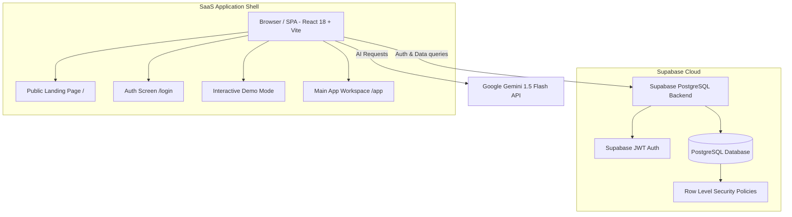

# Orbit CRM — Commercial AI-Powered Multi-Tenant Sales Workspace

Orbit CRM is a modern, high-velocity B2B Sales & Outreach CRM SaaS platform built with **React 18**, **Vite**, **Supabase (PostgreSQL & RLS)**, and **Google Gemini AI**. Designed for founders, growth agencies, consultants, and sales teams to manage leads, customer relationships, cold calling queues, and visual deal pipelines from a unified AI-assisted workspace.

---

## 🌟 Key Features

- **🚀 Interactive Portfolio Demo Mode**: One-click instant `/demo` workspace allowing prospective buyers, recruiters, and clients to explore sample B2B CRM data without registration.
- **✨ Native Google Gemini AI Suite**:
  - **AI Lead Summarizer**: Generates executive lead overviews from contact background and activity history.
  - **Explainable Lead Intent Score (0–100)**: Evaluates intent based on channels, engagement history, and decision authority.
  - **Smart Follow-Up Generator**: Drafts context-aware sales follow-ups in *Professional*, *Casual*, or *Urgent* tones with 1-click clipboard copy.
  - **AI Meeting Notes Processor**: Extracts key themes, requirements, and follow-up tasks from raw call transcripts.
  - **AI Natural Language Search**: Query CRM using prompts like *"contacts not contacted"* or *"high value deals"*.
- **📊 Executive Dashboard & Kanban Pipeline**:
  - Real-time analytics: Total Revenue, Pipeline Value, Win Rate %, Average Deal Cycle, Overdue Tasks, Today's Follow-ups.
  - Interactive drag-and-drop Kanban deal pipeline (*New Lead → Contacted → Qualified → Proposal → Negotiation → Won/Lost*).
- **🔒 Multi-Tenant RLS Security**:
  - Built-in tenant isolation with `workspace_id` and Role-Based Access Control (RBAC: `owner`, `admin`, `manager`, `member`).
  - Strict Supabase Row Level Security policies guaranteeing Zero cross-tenant data leakage.

---

## 🏗️ System Architecture



---

## 🗄️ Database Model & Migrations

The database is structured in PostgreSQL via Supabase migrations (`supabase/migrations/`):

1. **`001_initial_schema.sql`**: Baseline tables (`contacts`, `leads`, `tasks`, `activity_log`, `lead_lists`, `businesses`, `industries`, `sources`, `folders`).
2. **`002_rls_policies.sql`**: RLS rules restricting row-level operations to authenticated users (`auth.uid() = user_id`).
3. **`004_multi_tenant_workspaces.sql`**: Multi-tenant workspace schema (`workspaces`, `workspace_members`, `organizations`, `workspace_id` foreign keys, and RBAC policies).

---

## 🚀 Quick Start & Local Setup

### 1. Prerequisites
- **Node.js**: v18+ recommended
- **npm** or **yarn**

### 2. Installation
```bash
git clone https://github.com/saimadeel894-boop/orbit-crm.git
cd orbit-crm
npm install
```

### 3. Environment Configuration
Create a `.env` file in the project root:
```env
VITE_SUPABASE_URL=https://your-supabase-project.supabase.co
VITE_SUPABASE_ANON_KEY=your-supabase-anon-key
VITE_GEMINI_API_KEY=your-gemini-api-key
```

### 4. Run Locally
```bash
npm run dev
```

---

## 📄 License & Commercial Distribution

Commercial SaaS Edition v1.0.0. Developed as a production-grade portfolio project and customizable SaaS CRM foundation.
For commercial licensing inquiries, contact [licensing@orbitcrm.io](mailto:licensing@orbitcrm.io).
